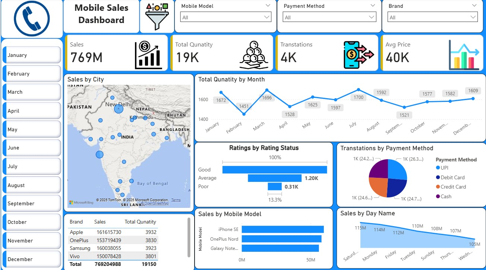

# 📱 Mobile Sales Dashboard

## 📌 Overview
The **Mobile Sales Dashboard** is an interactive visual representation of mobile phone sales data.  
It helps in analyzing sales, customer ratings, payment methods, and brand-wise comparisons.

## ✨ Features
- KPIs on Totals, Quantities, Transactions, and Average Price  
- Sales by City (map visualization)  
- Monthly sales trends  
- Ratings analysis (Good, Average, Poor)  
- Transactions by Payment Method (UPI, Debit Card, Credit, Cash)  
- Sales by Brand & Model  
- Day-wise sales performance  

## 🖼️ Dashboard Preview

## 🛠️ Tech Stack
- **Power BI** – for dashboard visualization  
- **Excel / CSV dataset** – as source of data  
- *(Optional: Python/SQL for preprocessing)*  

## 📂 Project Structure
